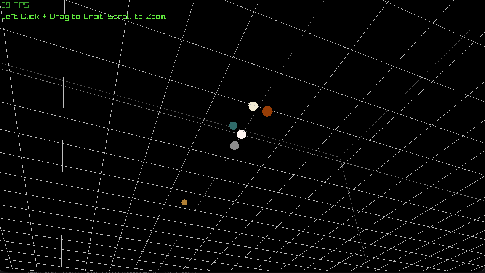

# Gravity Simulator

An n-body gravity simulation of the solar system, written in C++ with raylib.
Real ephemeris data, real physics, no fudged constants.



## Why

I've always had an interest in physics, and figured combining it with
programming was worth doing. This is a simulation of how objects in our solar
system interact with each other.

## What it does

Ten bodies, every pair, every frame. Each body's position and velocity come
from real measurements rather than idealised circular orbits, so the
eccentricities and inclinations are the ones the actual solar system has.

- All-pairs gravitational force computation, using Newton's third law so each
  pair is evaluated once
- Semi-implicit Euler integration, which conserves energy far better than the
  explicit form
- Full 3D, including the orbital inclinations
- Rendered with a perspective camera you can orbit and zoom, over a grid
  where every cell is one astronomical unit

## The math

**Newton's law of universal gravitation**

```
F = G * m1 * m2 / r²
```

**Euclidean distance** (Pythagorean theorem)

```
r = sqrt(dx² + dy² + dz²)
```

**Vector normalization**

```
unit = (dx / r, dy / r, dz / r)
```

**Newton's second law**

```
a = F / m
```

**Newton's third law**

```
force on i = -force on j
```

**Semi-implicit Euler integration**

```
v += a * dt
p += v * dt
```

## The data

`ephemeris.csv` holds state vectors pulled from NASA JPL Horizons for a single
epoch, in barycentric coordinates. Barycentric matters: the solar system's
centre of mass has zero net momentum, so the whole system stays put instead of
drifting off through space.

Units are SI throughout. Mass in kilograms, distance in metres, velocity in
metres per second.

The loader reports the row and field name when a value fails to parse, which
turned out to be necessary.

## Validation

The physics is checked against known orbital values rather than assumed
correct.

Mercury oscillates between **0.307 and 0.467 AU**, which are its actual
perihelion and aphelion. Earth completes an orbit in **360 simulated days**.
All ten bodies sit within their real orbital ranges.

## Building

Requires `raylib` and CMake:

```sh
brew install raylib cmake
cmake -S . -B build
cmake --build build
./build/gravity
```

## Controls

| Input | Action |
|---|---|
| Left click and drag | Orbit the camera |
| Scroll | Zoom |

## Next

- [ ] Orbital trails
- [ ] Add the Moon, which needs a smaller timestep than the outer planets tolerate
- [ ] Runtime timestep control
- [ ] Verlet integration, with an energy drift comparison against Euler
- [ ] Barnes-Hut, once there are enough bodies to justify it